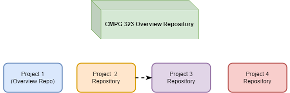

# CMPG-323-Overview---31586872

## Repositories for Projects:
- Project 2: https://github.com/Hugovs2000/CMPG-323-Project-2---31586872.git
- Project 3: https://github.com/Hugovs2000/CMPG-323-Project-3---31586872.git
- Project 4: https://github.com/Hugovs2000/CMPG-323-Project-4---31586872.git
- Project 5: https://github.com/Hugovs2000/CMPG-323-Project-5---31586872.git

## Branching Strategies:
- For each project a Main branch will be used to host the most current version.
- There will be a Develop branch which will be used to make changes.
- The two branches will be merged to form the most current version.

## .gitignore file uses:
The .gitignore file will be used to specify which documents will be ignored
by Git making it possible to have a text document which holds sensitive
information to go unseen for example.

## Storage of credentials and sensitive information:
Credentials and sensitive information can be stored in any form for example a
text document which will be specified in the .gitignore file and therefore be 
hidden from other users.

## Reference List:
Anon. 2022. Gitflow Workflow. https://www.atlassian.com/git/tutorials/comparing-workflows/gitflow-workflow Date of access: 14 August 2022.

Anon. 2022. Ignoring Files. https://docs.github.com/en/get-started/getting-started-with-git/ignoring-files Date of access: 15 August 2022.

Haddad. 2022. What Are the Best Git Branching Strategies. https://www.flagship.io/git-branching-strategies/#:~:text=A%20branching%20strategy%2C%20therefore%2C%20is,interact%20with%20a%20shared%20codebase Date of access: 14 August 2022.
